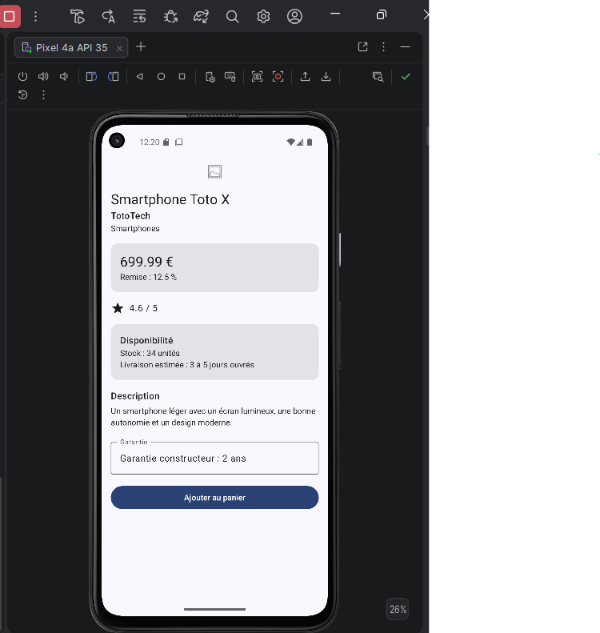
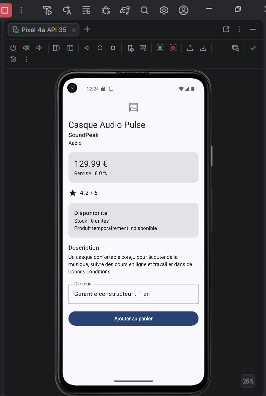
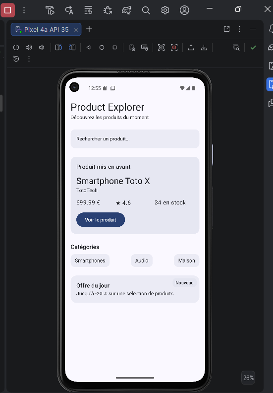
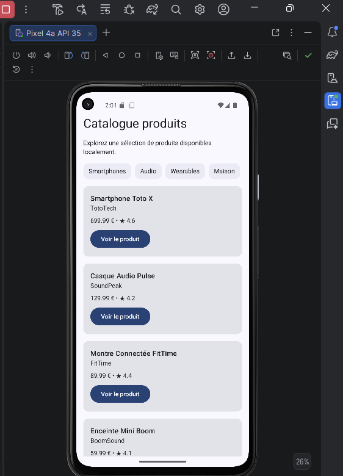

# Product Explorer

Application Android Jetpack Compose développée dans le cadre du Bloc 2 – Compose UI. Elle
affichera à terme un catalogue produit complet ; pour l'instant, elle contient un écran de détail
produit (TP4) et un écran d'accueil (TP5), tous deux construits avec Jetpack Compose.

---

## TP4 – Écran de détail produit

Écran de détail produit construit avec les composants fondamentaux de Compose : `Text`, `Button`,
`Icon`, `Image`, `Card` et `TextField`.

L'écran assemble plusieurs composables réutilisables, chacun responsable d'une seule information :
une image produit, un en-tête (nom, marque, catégorie), une carte prix/remise, une note avec une
icône étoile, une carte de disponibilité (stock, livraison), une description, un champ garantie en
lecture seule et un bouton d'action.

### Structure du projet

```
app/src/main/java/com/example/productexplorer/
└── MainActivity.kt
    ├── MainActivity              # Activity : thème + Scaffold
    ├── ProductDetailScreen        # assemble tous les blocs de l'écran
    ├── ProductHeader              # nom, marque, catégorie (MaterialTheme.typography)
    ├── ProductPriceCard           # Card : prix + remise
    ├── ProductImage               # Image + painterResource + contentDescription
    ├── ProductRating              # Row + Icon(Icons.Default.Star) + Text
    ├── ProductAvailabilityCard    # Card : stock + livraison
    ├── ProductDescription
    ├── ProductWarrantyField       # OutlinedTextField en lecture seule
    ├── AddToCartButton
    ├── ProductUi                  # données du produit
    ├── sampleProduct()            # produit en stock (previews + écran)
    └── sampleProductOutOfStock()  # produit en rupture de stock (preview)
```

### Previews

Deux `@Preview` sont disponibles dans `MainActivity.kt`, montrant chacune un produit différent :
`ProductDetailScreenPreview` (en stock) et `ProductDetailScreenOutOfStockPreview` (rupture de
stock).

### Aperçu

| Produit disponible | Produit indisponible |
|---|---|
|  |  |

Les mêmes composables affichent ici deux produits totalement différents (nom, catégorie, prix,
stock, description), ce qui montre qu'ils sont bien paramétrés plutôt que figés sur un seul produit.

---

## TP5 – Écran d'accueil (Layouts Compose)

Écran d'accueil de Product Explorer, construit avec les principaux layouts de Compose : `Column`,
`Row`, `Box`, `Spacer` et `Surface`. C'est désormais cet écran qui s'affiche au lancement de
l'application ; l'écran de détail du TP4 reste dans le code mais n'est plus appelé directement.

L'écran assemble : un en-tête (`HomeHeader`), une zone de recherche visuelle (`SearchPreviewBar`),
une carte de produit mis en avant avec une ligne prix/note/stock et un bouton d'action
(`FeaturedProductSection` + `ProductQuickInfoRow`), une section de catégories (`CategoriesSection`
+ `CategoryChip`), et un bloc « Offre du jour » avec un badge superposé grâce à `Box`
(`DailyOfferBox`).

### Structure du projet

```
app/src/main/java/com/example/productexplorer/
└── MainActivity.kt
    ├── ProductHomeScreen          # assemble toutes les sections de l'accueil
    ├── HomeHeader                 # titre + sous-titre
    ├── SearchPreviewBar           # Surface : barre de recherche visuelle
    ├── FeaturedProductSection     # Surface + Column + Button : produit mis en avant
    ├── ProductQuickInfoRow        # Row : prix, note, stock (weight égal)
    ├── CategoryChip               # Surface : une catégorie
    ├── CategoriesSection          # Column + Row : liste de catégories
    └── DailyOfferBox              # Box + 2 Surface : bloc + badge superposé
```

### Previews

`ProductHomeScreenPreview` montre l'écran d'accueil complet avec le produit `sampleProduct()`.

### Aperçu

<p align="center">
  
</p>

L'écran contient bien les six éléments demandés : en-tête, zone de recherche, produit mis en avant,
catégories, section « Offre du jour », et un bouton vers le produit mis en avant (sans navigation
réelle pour l'instant).

---

## TP6 – Catalogue local de produits (Listes modernes)

Écran catalogue de Product Explorer, construit avec les listes modernes de Compose : `LazyColumn`
et `LazyRow`. C'est désormais cet écran qui s'affiche au lancement de l'application ; les écrans du
TP4 et du TP5 restent dans le code mais ne sont plus appelés directement.

Chaque produit possède désormais un identifiant (`id`), utilisé comme clé stable dans la liste.
L'écran assemble, dans une seule `LazyColumn` : un titre, une courte description, une ligne
horizontale de catégories (`CategoryRow`, avec `LazyRow`, réutilisant `CategoryChip` du TP5), puis
la liste verticale des produits, chacun affiché par une carte réutilisable (`ProductListItem`).

### Structure du projet

```
app/src/main/java/com/example/productexplorer/
└── MainActivity.kt
    ├── ProductCatalogScreen       # LazyColumn : titre, description, catégories, produits
    ├── ProductListItem            # Card : une carte produit réutilisable
    ├── CategoryRow                # LazyRow : liste horizontale de catégories
    ├── ProductUi                  # + champ id
    └── sampleProducts()           # catalogue local de 4 produits
```

### Previews

`ProductCatalogScreenPreview` montre le catalogue complet avec les 4 produits de `sampleProducts()`.

### Aperçu

<p align="center">
  
</p>

L'écran contient bien les quatre éléments demandés : un titre de catalogue, une ligne horizontale
de catégories, une liste verticale de produits, et une carte réutilisable pour chaque produit.
